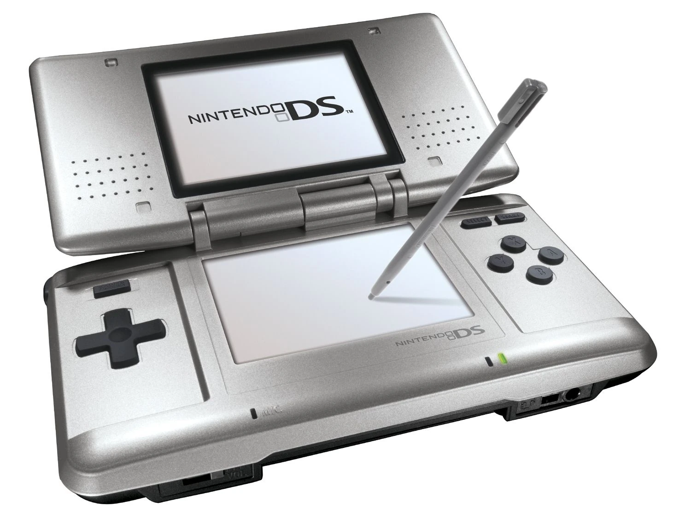
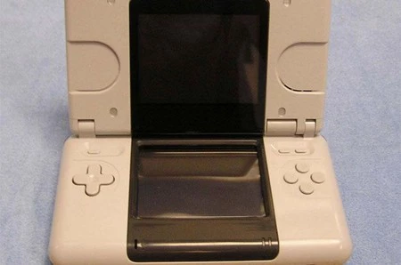
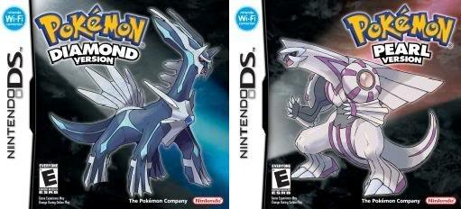
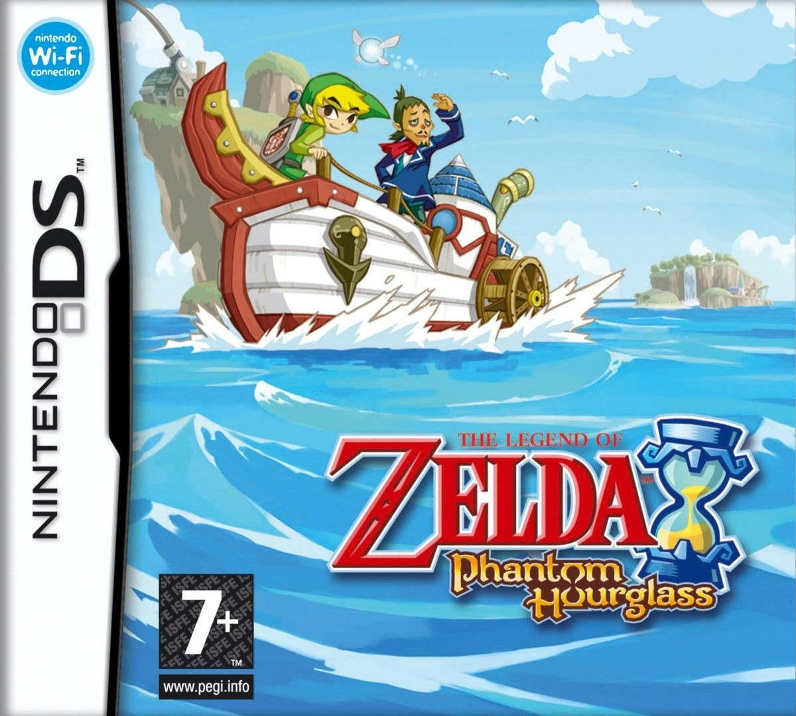
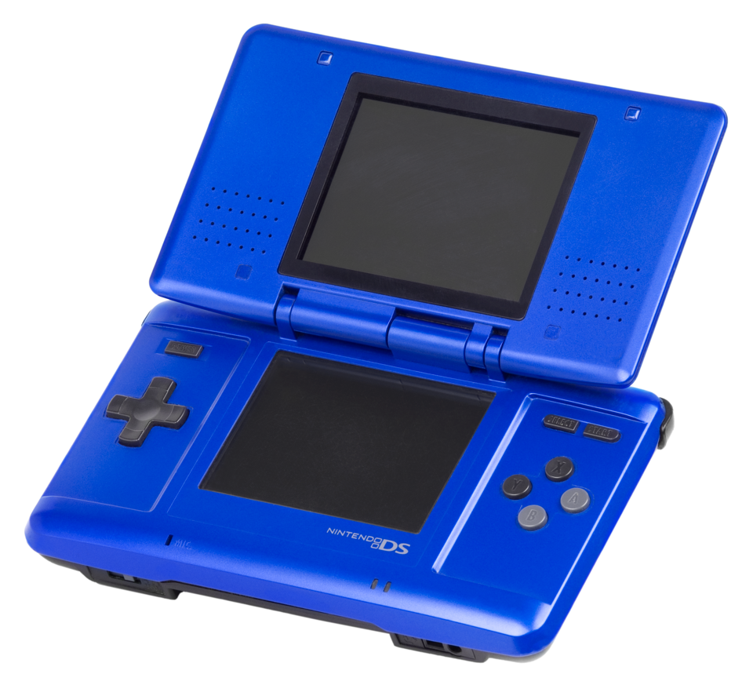
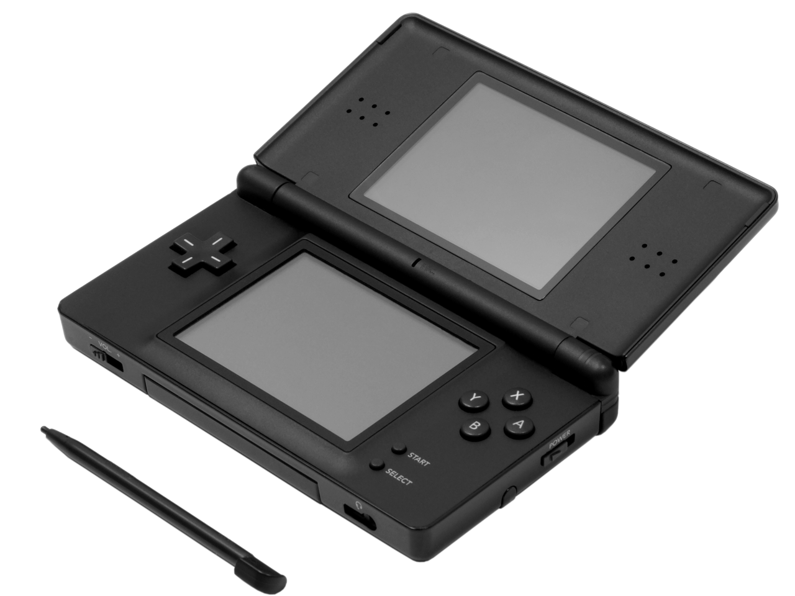
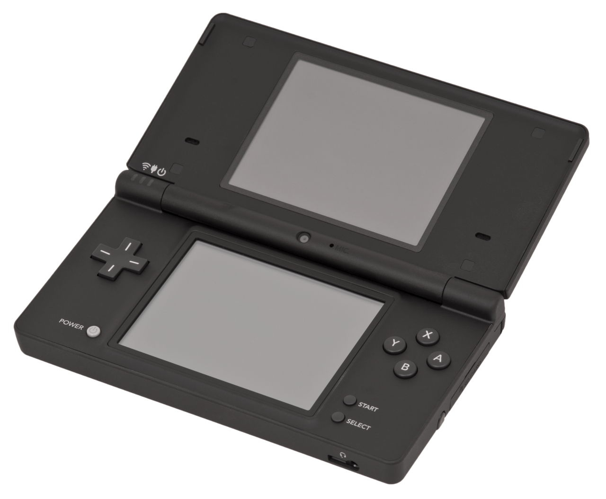
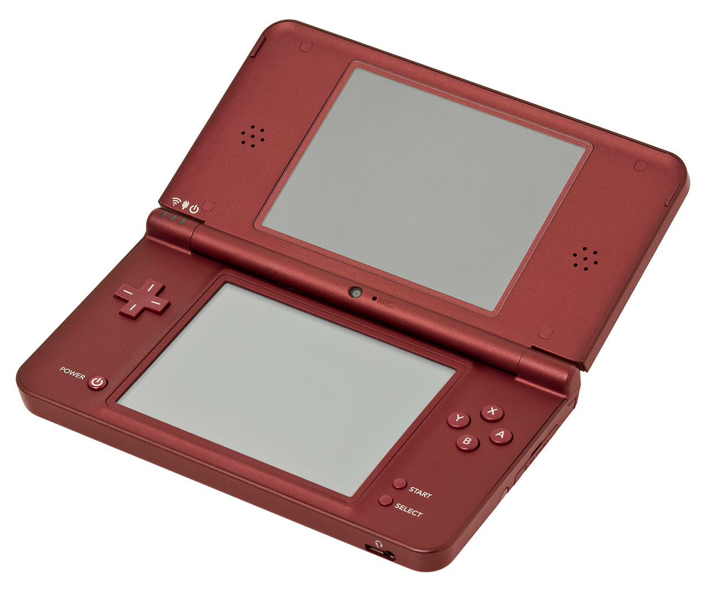
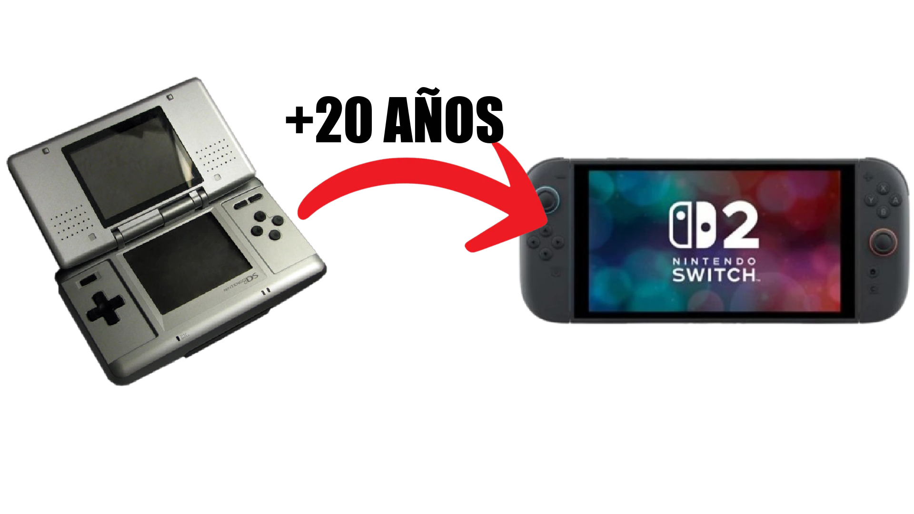

# Prueba_RA2 - Jorge González Burgos
## **Ejercicio 1**

### **1A**
No se ve centrado porque el único elemento que hay es el `h1` y el contenedor no es más alto que este, y como tampoco hay varios elementos, simplemente no hay espacio donde moverlo.

### **1B**
Una forma sencilla de solucionarlo es simplemente añadir `flex-direction: column;` en el CSS, de forma que quedaría así:
```css
.site-header {
  display: flex;
  flex-direction: column;
  justify-content: space-between;
  align-items: center;
  
}
h1 {
  text-align: center;
}
```

Usando Grid, simplemente reemplazo grid por flex en el `display` del css y añado `grid-template-columns: auto;`, quedando así el resultado:
```css
.site-header {
  display: grid;
  grid-template-columns: auto;
  
}

h1 {
  text-align: center;
}
```

El resultado para ambas soluciones es el `h1` centrado en la cabecera de la página web.


### **1C**
Para hacer que el menú de navegación también quede centrado horizontalmente, le añado un `flex` y un `margin-top`, para respetar la distancia de 30px,
 quedando de la siguiente forma:
```css
.site-header {
  display: grid;
  grid-template-rows: auto;
  
}

h1 {
  text-align: center;
}

.main-nav{
  margin-top: 30px;
  display: flex;
  flex-direction: column;
  align-items: center;
}
```

### **1D**
Para conseguir un aspecto más definido y que se diferencie del resto de la página, simplemente añado a la etiqueta `.site-header` un color de fondo con 
`background-color`, un `padding` para que tenga espacio por dentro, un `box-shadow` para darle relieve y un `border-radius` para darle un poco más de estética.
El código CSS quedaría de la siguiente forma:
```css
.site-header {
  display: grid;
  grid-template-rows: auto;
  background-color: lightblue;
  padding: .5em;
  box-shadow: 5px 7px 2px rgba(0, 0, 0, 0.1);
  border-radius: 5px;
  
}

h1 {
  text-align: center;
}

.main-nav{
  margin-top: 30px;
  display: flex;
  flex-direction: column;
  align-items: center;
}

```

## **Ejercicio 2**

### **2A**
Muevo el botón hambuergesa del menú al header:
```html
<header class="site-header">
    <h1>Nintendo DS y el cambio generacional</h1>

    <nav class="main-nav">
        <a href="#hero"> Inicio </a>
        <a href="#sec1"> Revolución </a>
        <a href="#sec2"> Versatilidad </a>
        <a href="#sec3"> Catálogo </a>
        <a href="#chart"> Tabla </a>
        <a href="#consecuencias"> Consecuencias </a>
        <a href="#form"> Formulario </a>
        <a href="#gallery"> Galería </a>
        <a href="#contact"> Contacto </a>
    </nav>

     <button class="open-menu" aria-label="Abrir menú lateral">☰</button>
     
  </header>
```

### **2B**
Para hacer que el botón, el `h1` y el `nav` queden centrados, modifico en mi CSS la etiqueta `.site-header` cambiando los valores `flex-direction` y 
`justify-content`, quedando de la siguiente forma:
```css
.site-header {
  position: sticky;
  top: 0;
  z-index: 10;
  display: flex;
  flex-direction: row;
  align-items: center;
  justify-content: center;
  background: rgba(50, 50, 50, 0.6);
  backdrop-filter: blur(8px);
  padding: 0.8em 2em;
  border-radius: 0 0 20px 20px;
  margin: 0 4em;
  transition: transform 0.3s ease;
}
```
El único problema que surge ahora es que el botón queda escondido una vez pulsado.

## **Ejercicio 3**
En el caso de mi página, ya tengo imágenes más pequeñas en la galería que sirven como previsualización.

### **3A / 3B**
En mi CSS, cuando paso el ratón por encima la miniatura se hace más grande y lo he hecho de la siguiente forma:
```css
#gallery img {
  width: 250px;
  border-radius: 12px;
  box-shadow: 0 3px 10px rgba(0, 0, 0, 0.15);
}
#gallery img:hover {
  transform: scale(1.05);
}
```
Lo que hago es establecer un `border-radius`, un `width` y un `box-shadow` a la imgagen y luego cuando paso el ratón por encima, hago que se escale la imagen.

### **3C**
Para hacer que se abra en otra petaña al hacer clic, en el HTML lo que he hecho ha sido añadir un `<a href>` con la dirección de la propia imagen, dentro de cada `<figure>`. 
El resultado es el siguiente:
```html
<h2>Galería de imágenes</h2>
        <figure>
          <a href="img/NDS.png"></a> <!-- los <a> estan asi puestos para poder hacer clic en la imagen y que se vea en grande -->
          <figcaption>Primer modelo de la Nintendo DS</figcaption>
        </figure>
        <figure>
          <a href="img/NDS_presentacion.png"></a>
          <figcaption>Expresidente de Nintendo America, Reggie Fils-Aimé en la presentación de Nintendo DS</figcaption>
        </figure>
        <figure>
          <a href="img/NDS_prototipo.png"></a>
          <figcaption>Diseño beta de la consola durante su desarrollo</figcaption>
        </figure>
        <figure>
          <a href="img/NDS_presentacion2.png"></a>
          <figcaption>Expresidente de Nintendo, Satoru Iwata en la presentación de Nintendo DS</figcaption>
        </figure>
        <figure>
          <a href="img/PokemonDP.png"></a>
          <figcaption>Pokémon Diamante y Perla para Nintendo DS</figcaption>
        </figure>
        <figure>
          <a href="img/ZeldaPH.png"></a>
          <figcaption>Zelda Phantom Hourglass para Nintendo DS</figcaption>
        </figure>
        <figure>
          <a href="img/DSCatalogo.png"></a>
          <figcaption>Parte del catálogo de Nintendo DS recopilado en una imagen</figcaption>
        </figure>
        <figure>
          <a href="img/NintendoDS.png"></a>
          <figcaption>Nintendo DS (2004)</figcaption>
        </figure>
        <figure>
          <a href="img/DSLite.png"></a>
          <figcaption>Nintendo DS Lite (2006)</figcaption>
        </figure>
        <figure>
          <a href="img/DSi.png"></a>
          <figcaption>Nintendo DSi (2009)</figcaption>
        </figure>
        <figure>
          <a href="img/DSiXL.png"></a>
          <figcaption>Nintendo DSi XL (2010)</figcaption>
        </figure>
        <figure>
          <a href="img/DSActualidad.png"></a>
          <figcaption>Imagen representativa de la evolución del hardware tras Nintendo DS</figcaption>
        </figure>
    </section>
```

## **Ejercicio 4**

### **4.1**

### **4.2**

### **4.3**

### **4.4**

### **4.5**

### **4.6**

